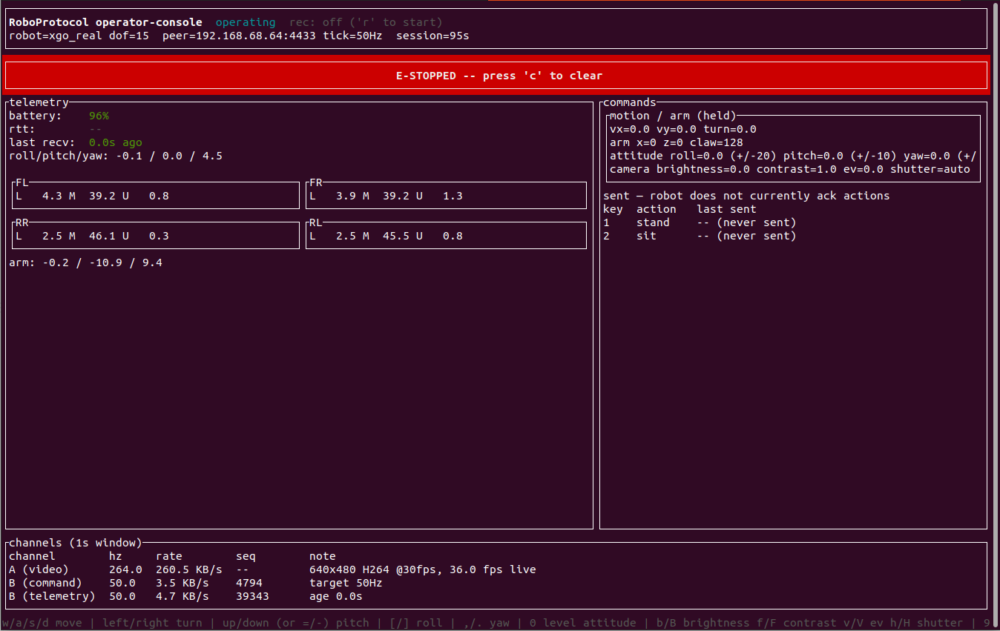
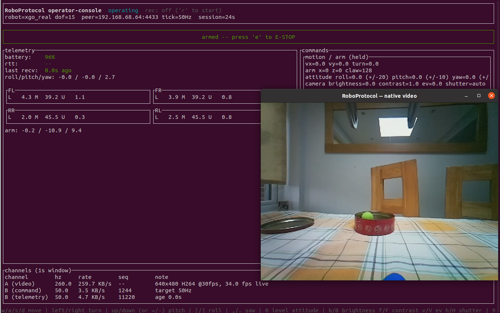

# RoboProtocol: Secure Low-Latency Robotic Teleoperation

RoboProtocol is a specialized network protocol and safety architecture designed for real-time, high-fidelity teleoperation of physical systems, particularly humanoid robots and high-DoF manipulators.

## Why Design a Protocol Specifically for Robot Teleoperation?

Existing internet protocols (TCP, WebSockets, gRPC, and standard WebRTC) were designed for static data transfer, web applications, or human-to-human media streaming. They fail to address the unique physics, safety requirements, and control loops of physical robots.

### 1. Eliminating Head-of-Line (HoL) Blocking
* **The Problem:** Protocols like TCP and standard WebSockets prioritize guaranteed delivery over timeliness. If a single packet drops, the network stack holds up all subsequent packets until the dropped packet is retransmitted.
* **The Teleoperation Impact:** In a $1\text{ kHz}$ control loop, holding up packets for even $20\text{ ms}$ causes command starvation. Actuators will experience sudden torque drops or velocity jumps when the queue finally clears, causing mechanical instability.
* **RoboProtocol Solution:** Separates media streams and control loops into unreliable, multiplexed UDP channels. Stale control packets are dropped instantly; lost packets trigger local decay-based dead reckoning.

### 2. Maintaining Bilateral Haptic Passivity
* **The Problem:** Teleoperation with force feedback (where the operator feels the physical forces acting on the robot) requires a closed-loop system. Network delay introduces phase lag.
* **The Teleoperation Impact:** Phase-lagged force feedback injects virtual energy into the loop, making the master-slave system non-passive. This results in violent, uncontrollable physical oscillations (tremors) that can break the robot or injure the operator.
* **RoboProtocol Solution:** Integrates the Time-Domain Passivity Approach (TDPA) directly into the QUIC control datagram headers (Channel B). The transport layer continuously monitors energy flow ($E(t) = \int F \cdot v \, dt$) and attenuates haptic feedback forces when virtual energy is detected.

### 3. Human Perception & Task-Class Sensitivity
* **The Problem:** The latency threshold at which a task becomes unperformable varies by an order of magnitude depending on the application (e.g., fine tool manipulation vs. outdoor walking).
* **The Teleoperation Impact:** A hardcoded suspension threshold of $1.0\text{ s}$ is perfectly fine for gross outdoor locomotion, but catastrophically high for fine tool use, which demands suspension by $150\text{ ms}$.
* **RoboProtocol Solution:** Implements a Task-Adaptive Safety State Machine (Classes B through E) that dynamically scales safety warnings, velocity clamping, and suspension thresholds based on the active operational task.

### 4. Dynamic IP Mobility & Handover
* **The Problem:** Mobile robots operating in industrial environments switch frequently between cellular (5G/LTE) and Wi-Fi access points.
* **The Teleoperation Impact:** A handoff changes the robot's IP address. Sessions identified by the IP/Port 4-tuple alone would drop, forcing a multi-RTT cryptographic re-handshake.
* **RoboProtocol Solution:** Mandates **QUIC Connection IDs (RFC 9000 §19)**, allowing the secure control session to persist across network handovers via QUIC Connection Migration without re-handshaking or control interruption.

### 5. Kinematic & Balance Override Authority
* **The Problem:** Standard communication protocols treat all payloads equally and lack awareness of the robot's physical state.
* **The Teleoperation Impact:** If the operator sends a command that violates joint limits or pushes the robot's Center of Mass (CoM) outside its support polygon, the robot will fall or damage its joints.
* **RoboProtocol Solution:** Enforces low-level Whole-Body Controller (WBC) override authority. The robot edge controller intercepts incoming trajectory packets and overrides them with balance recovery routines if instability is detected.

---

## Supported Robot Profiles

RoboProtocol doesn't hardcode a single robot's joint layout into the wire format. Each session starts with a `SESSION_DESCRIBE`/`SESSION_ACCEPT` exchange (Channel C) that negotiates a `RobotProfile` — the robot's degrees of freedom, body regions, per-region command semantics, and base morphology — which both endpoints then use to derive the same Channel B byte layout (see [Protocol Architecture § SESSION_DESCRIBE](docs/02-protocol-architecture.md#session_describe--session_accept--robot--media-profile)).

### Base morphology types

A profile declares one `BaseType` — a hardware fact, not a negotiable capability — that governs safety-relevant behavior like whether Whole-Body Controller balance override is meaningful and whether lateral velocity makes sense for the base:

| Base type | Description |
| --- | --- |
| `Stationary` | Fixed-base manipulator, no locomotion at all. |
| `WheeledStandard` | Differential/Ackermann drive — lateral motion not independently commandable. |
| `WheeledHolonomic` | Mecanum/omni wheels — lateral motion independently commandable. |
| `BipedLegs` | Two legs, dynamically balanced — WBC/ZMP balance override is load-bearing. |
| `QuadrupedLegs` | Four or more legs, statically stable — WBC/ZMP balance override is a documented no-op. |
| `Other` | A morphology not covered above (tracked, aerial, etc.) — reserved for forward compatibility. |

### Per-region command shapes

Each body region within a profile (an arm, a leg group, a wheeled base) also declares a `CommandShape`, since not every region is commanded the same way:

- **`Kinematic`** — one command field per joint (direct per-joint targets).
- **`VelocityAttitude`** — whole-robot body velocity/attitude (`vx`, `vy`, `turn`, `roll`, `pitch`, `yaw`). Shared across every region tagged this way rather than commanded per-region, since a legged or wheeled base doesn't have an independent velocity per leg or wheel.
- **`CartesianEndEffector`** — target position + gripper, independently targetable per region (e.g. each arm of a dual-arm robot).

### What ships today

v0 ships exactly one concrete robot profile: the **[XGO-Lite V2](https://wiki.elecfreaks.com/en/pico/cm4-xgo-robot-kit/product-introduction/xgo-lite-v2-product-instruction/)** quadruped (with the optional arm/gripper accessory) — a Raspberry Pi CM4-based kit with 12 leg servos plus a 3-DoF Cartesian-commanded arm/gripper — 15 DoF across 5 regions (4 leg regions as `QuadrupedLegs`/`VelocityAttitude`, 1 arm region as `CartesianEndEffector`), streaming a single front-facing H.264 camera. See the [XGO-Lite V2 Guide](docs/06-xgo-lite-guide.md) to run it. Authoring new profiles for other hardware (a URDF + build-config pipeline, rather than a hand-written Rust constant) is on the roadmap — see [Design Review & Roadmap](docs/09-design-review-and-roadmap.md).

### Operator console, live

The `operator-console` TUI against a real XGO-Lite V2 — telemetry, commands, and per-channel wire rates all update live in the terminal:

  
  

Left: the watchdog has latched an **E-Stop** (`robot=xgo_real`, 15 DoF, 50 Hz tick) — the banner, telemetry, and command panels are all driven by live Channel B/C traffic. Right: the same session `armed`, with the `--video-backend native` path open in a second window — Channel A's H.264 stream decoded via `openh264` and displayed directly, no external player required.

---

## Documentation

Browsable, organized documentation covering the protocol specification and the
XGO-Lite V2 reference implementation lives in **[`docs/`](docs/README.md)** — start
there for a guided tour. The root-level documents below remain the authoritative
source of truth for exact spec wording.

## Repository Structure

* [README.md](README.md): Project overview and motivation.
* [xgo_bridge/RUNME.md](xgo_bridge/RUNME.md): Operational runbook for running `robot-edge`/`operator-console` against a real XGO-Lite V2 — launching both sides, keybindings, and local recording.
* [LICENSE](LICENSE): PolyForm Noncommercial License 1.0.0.

