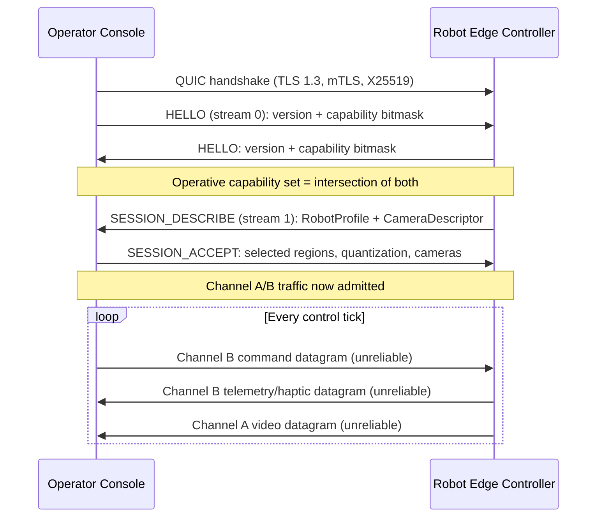

# Protocol Architecture

Full detail lives in `DESIGN.md` (Part I: Protocol Specification). This page is a
browsable map of it.

## The stack

RoboProtocol is built on **QUIC (RFC 9000)** extended with **unreliable datagrams
(RFC 9221)**. QUIC natively bundles TLS 1.3, stream multiplexing over one UDP socket,
0-RTT resumption, and seamless Connection Migration during network handovers.

```text
+-----------------------------------------------------------------------------------+
|                            APPLICATION / ROBOT INTERFACE                          |
+-----------------------------------------------------------------------------------+
|  Channel A: Video Feeds     |  Channel B: Cmd/Telemetry     | Channel C: State    |
|  - QUIC Datagrams (RFC 9221)|  - QUIC Datagrams (RFC 9221)| - Reliable QUIC     |
|  - FlexFEC (RFC 8627)       |  - 100 Hz - 1 kHz Loop      |   Streams           |
|  - Dynamic Bitrate Control  |  - Passivity Observer (TDPA)  | - ROS 2 Tunneling   |
|                             |                               | - Emergency Stop    |
+-----------------------------------------------------------------------------------+
|                     QUIC (RFC 9000) + TLS 1.3 Transport Layer                     |
|                 (Native Connection Migration & Multiplexing)                      |
+-----------------------------------------------------------------------------------+
|                            UDP Network Transport (5G / Wi-Fi 6)                   |
+-----------------------------------------------------------------------------------+
```

| Layer | Protocol Choice | Function |
| --- | --- | --- |
| Application (Video) | H.265 / AV1 (PIR mode) | Periodic Intra-Refresh video, zero B-frames, over QUIC Datagrams |
| Application (Control) | FlatBuffers over QUIC Datagrams | Sub-millisecond zero-copy serialization for joint angles, haptic vectors, TDPA metadata |
| Transport & Framing | QUIC (RFC 9000) + RFC 9221 Datagrams | Unreliable/reliable stream multiplexing, sequencing, 64-bit NTP timestamps, inline FlexFEC |
| Security & Session | TLS 1.3 (AES-256-GCM / ChaCha20-Poly1305) over X25519 | Native datagram encryption, mutual Ed25519 certificate auth, scoped 0-RTT resumption |
| Session Mobility | QUIC Connection Migration (RFC 9000 §19) | Connection-ID-based session persistence across IP handovers |
| NAT Traversal | Relay-first + opportunistic direct upgrade | See [§ NAT traversal](#nat-traversal--relay-fallback) below |
| Datagram Demux | 1-byte channel discriminator | Distinguishes Channel A/B/E-Stop before any decode is attempted |
| Session Establishment | `HELLO` (Channel C, stream 0) | Version + capability negotiation, gates all other traffic |
| Session Description | `SESSION_DESCRIBE` / `SESSION_ACCEPT` (Channel C, stream 1) | Binary robot/camera profile exchange; Channel B's field layout derives from it |

## Session bring-up sequence



Neither endpoint processes Channel A, Channel B, or Channel C ROS 2 traffic until it
has both sent and received a `HELLO`, and that gate stays closed through the
`SESSION_DESCRIBE`/`SESSION_ACCEPT` round trip as well — `HELLO` only establishes
*that* the endpoints can talk; `SESSION_DESCRIBE` establishes *what the bytes mean*
for this specific robot. The one exception to both gates is the E-Stop redundant
datagram path, which is active immediately at the transport layer (`DESIGN.md` §1.2.1).

### `HELLO` — version & capability handshake

A FlatBuffers `RoboProtocolHello` table exchanged over Channel C stream 0:

| Field | Type | Purpose |
| --- | --- | --- |
| `protocol_version` | `uint16` (`major<<8 \| minor`) | Endpoints negotiate `min(local_max, peer_max)` within a shared major version |
| `capability_bitmask` | `uint64` | TDPA, FlexFEC, ROS 2 bridge, connection migration, etc. |
| `supported_task_classes` | `uint8` bitmask | Bit 0=Class B … 3=Class E |
| `supported_quantization_tiers` | `uint8` bitmask | Full / Standard / Compact |
| `max_control_rate_hz` | `uint16` | Highest sustainable control loop rate |
| `extensions` | `[TLV]` | Forward-compatible fields added after v1.0 |

If the two endpoints share no common major version, the connection closes with
`HELLO_INCOMPATIBLE` before any actuation stream opens. If a capability required by
the requested task profile is missing — most importantly TDPA — the initiator refuses
Full Teleoperation Mode and reports the gap explicitly rather than degrading haptics
silently (`DESIGN.md` §1.2.3).

### `SESSION_DESCRIBE` / `SESSION_ACCEPT` — robot & media profile

Sent robot → operator first (the robot is the sole authority on its own hardware),
as binary FlatBuffers — never JSON on the wire, even though integrators may still
*author* a profile as a URDF + JSON build config that the SDK compiles down.

```text
RobotProfile
├── dof_count, joints[JointDescriptor], regions[BodyRegionDescriptor]
└── base_type: Stationary | WheeledStandard | WheeledHolonomic | BipedLegs
                | QuadrupedLegs | Other

BodyRegionDescriptor
└── command_shape: Kinematic | VelocityAttitude | CartesianEndEffector

CameraDescriptor
└── codec, resolution, max_fps, bitrate range
```

Key ideas:

- **Command shape is per-region**, not global. A hybrid robot (e.g. velocity-controlled
  legs + a Cartesian-controlled arm) mixes shapes across regions. `VelocityAttitude`
  is the one shape that's shared per *robot*, not per region, since body-frame
  velocity isn't a per-limb quantity.
- **`base_type` is one whole-robot fact**, orthogonal to command shape. It gates
  whether the WBC/ZMP balance override (SR-1) does anything at all — see
  [Safety & Control](03-safety-and-control.md).
- **Field layout is derived, not transmitted.** Both endpoints compute the identical
  Channel B byte-offset layout from `RobotProfile` + the quantization tier in effect —
  there's no explicit per-field register table the way a fieldbus protocol has one.
- **Profile caching**: a `profile_hash` lets a reconnecting operator workstation reply
  `SESSION_ACCEPT{cached: true}` and skip re-transmitting a 40–50 DoF profile.

## Channel A — video

Unreliable QUIC datagrams carrying H.265/AV1 (or H.264, see below) with Periodic
Intra-Refresh — no I-frame spikes, no B-frame reordering delay. Loss recovery is
inline **FlexFEC (RFC 8627)**: missing packets are mathematically reconstructed, no
NACK round trip. Codec/resolution/bitrate range aren't negotiated on Channel A itself
— they come from the `CameraDescriptor` the robot advertised in `SESSION_DESCRIBE`.
This matters concretely on the reference hardware: the XGO-Lite V2's Raspberry Pi
CM4 (BCM2711) has no H.265/AV1 hardware encoder, so its `CameraDescriptor.codec`
advertises H.264 — the field exists precisely so a robot on this class of SoC can
say what it can actually produce.

## Channel B — command, telemetry & haptic

Bidirectional unreliable datagrams: operator→robot commands one way, robot→operator
telemetry and haptic feedback the other. Rate is operator-configured, capped at the
session's negotiated `max_control_rate_hz` (up to 1 kHz) — there is no protocol-imposed
floor beyond >0 Hz.

**Out-of-order handling is a hard invariant, not a policy:** the receiver tracks the
highest applied sequence number independently *per (body region, payload category)*
and discards anything not strictly newer, on arrival, without buffering to preserve
order. Reordering-to-preserve-order would reintroduce the head-of-line-blocking cost
the whole unreliable-datagram design exists to eliminate. The one carve-out is a
discrete one-shot element (e.g. `action_id`, a canned gait trigger) — it must not
share a staleness gate with the continuous fields it rides alongside, or a genuine
new trigger could be silently dropped along with a superseded `vx`/`vy`. New
integrations should send such triggers as a Channel C RPC instead.

**Lost-packet handling:** decay-based dead reckoning damps predicted velocity to zero
within roughly 1–2 control periods, scaled to whatever rate the session is configured
for — not a fixed millisecond constant.

**Motion reconstruction (timestamp-based interpolation):** solves a different problem
than loss — arrival jitter. The robot edge controller interpolates between the two
most recently received samples using their sender capture timestamps rather than
snapping to each sample the instant it arrives, so evenly-paced operator motion isn't
reproduced as jittery acceleration. This never applies to the Haptic category, since
TDPA depends on real-time energy flow and an interpolation delay would reintroduce
the exact phase lag TDPA exists to counteract.

### Payload sizing & quantization

A QUIC datagram is kept at or under **1200 bytes** of payload — safely below the MTU
fragmentation ceiling. Each field is packed at an operator-selected quantization tier,
chosen independently per payload category:

| Tier | Encoding | Bytes/field | Notes |
| --- | --- | --- | --- |
| Full | float32 | 4 | Low DoF count |
| Standard | int16 fixed-point | 2 | Default; **floor for haptic wrench/contact-force fields** |
| Compact | int8 delta-coded | 1 | Telemetry only, never haptic |

If a payload still exceeds the single-datagram budget at minimum quantization
(e.g. a 40–50 DoF full-body suit), it's split across multiple independently-timestamped
datagrams grouped by body region — never fragmented at the transport layer, since
RFC 9221 datagrams have no fragmentation/reassembly primitive and losing one fragment
would invalidate a whole logical frame otherwise.

## Channel C — state, ROS 2 tunneling & E-Stop

Reliable, ordered QUIC streams. Stream ID 0 is `HELLO`; subsequent streams carry
out-of-band RPCs, discrete one-shot triggers, and ROS 2 Action/Service tunneling.
Stream IDs follow QUIC's native numbering (low bits encode initiator/directionality),
not an arbitrary assignment — see `DESIGN.md` §1.3.5 for the exact scheme.

**E-Stop** is the one path that bypasses every gate above: transmitted over a
high-priority reliable stream *and* duplicated redundantly at 1 kHz over unreliable
datagrams, for sub-5 ms local edge processing regardless of handshake state.

## Datagram channel discriminator

Channel A and Channel B share one QUIC connection's unreliable-datagram flow, so
every datagram is prefixed with a 1-byte tag, inspected before any decode is
attempted:

| Tag | Channel | Payload |
| --- | --- | --- |
| `0x01` | Channel B | FlatBuffers `ChannelBFrame` |
| `0x02` | Channel A | Video chunk header + Annex-B NAL fragment |
| `0xE5` | E-Stop redundant datagram | Fixed 10-byte raw encoding (deliberately outside the sequential range) |

`0x03`–`0xDF` are reserved for post-v1.0 datagram categories.

## NAT traversal & relay fallback

Direct peer-to-peer (STUN-assisted hole-punching) is attempted, but doesn't gate
session start — RoboProtocol's cellular target environment makes symmetric NAT/CGNAT
routine, not an edge case, and a safety-critical control session shouldn't wait out
an ICE negotiation with a known non-trivial failure rate.

1. **Relay connect, always first.** Both endpoints dial out to a known QUIC-native
   relay (MASQUE/`CONNECT-UDP`, RFC 9298 — not classic STUN/TURN). `HELLO` and
   `SESSION_DESCRIBE` proceed over this connection exactly as specified.
2. **Background direct-path discovery**, exchanging STUN-reflexive candidates as
   ordinary Channel C application data — no separate signaling server needed.
3. **Opportunistic migration** to a validated direct path via the same QUIC
   Connection Migration mechanism used for Wi-Fi↔5G handover. If no direct path ever
   validates, the session simply continues over the relay — a supported outcome, not
   a degraded one.

The relay is a dumb forwarder: it pairs endpoints by session identifier, never
terminates TLS, and never holds session key material. `DESIGN.md` §9 sketches a
reference AWS deployment (Wavelength-first compute, NLB + Global Accelerator, a
shared session registry for load-balancer-safe rendezvous).

## Session mobility

```text
+-----------------------------------------------------------------------------------+
|                        QUIC CONNECTION MIGRATION WORKFLOW                         |
+-----------------------------------------------------------------------------------+
|  Active Connection: Bound to eth0 (Wi-Fi 6) | Connection ID: 0x8F3A2190           |
|  [Network Handoff Triggered -> Wi-Fi signal drops / 5G active]                    |
|  1. Operator endpoint sends PATH_CHALLENGE frame from wwan0 (5G) socket           |
|  2. Robot endpoint replies with PATH_RESPONSE frame over 5G path                  |
|  3. Connection CID (0x8F3A2190) remains valid; session migrates without           |
|     re-handshake                                                                  |
|  4. Control Datagram stream resumes immediately, no loss of TLS 1.3 state         |
+-----------------------------------------------------------------------------------+
```

## Software stack recommendation (`DESIGN.md` §5)

| Subsystem | Technology | Notes |
| --- | --- | --- |
| QUIC engine | `quiche` (Rust) | Memory-safe; one implementation, not a choice per endpoint, for guaranteed interop |
| Serialization | FlatBuffers | Zero-copy, maps directly into QUIC datagram buffers |
| Media | `libwebrtc` / FFmpeg (PIR) | Hardware-accelerated zero-copy encode |
| Crypto | BoringSSL (paired with `quiche`) | AES-256-GCM/ChaCha20-Poly1305, X25519, Ed25519 |
| ROS 2 | `rclcpp` C++ node | Zero-copy DDS ↔ FlatBuffers translation |

This is also exactly the stack the reference implementation uses in Rust — see
[Reference Implementation](05-reference-implementation.md).
