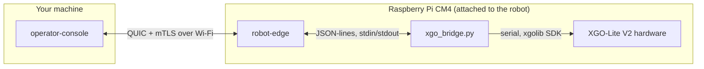

# XGO-Lite V2 Guide

How to run the reference implementation against a real **XGO-Lite V2** quadruped.
This is a condensed, browsable version of [`xgo_bridge/RUNME.md`](../xgo_bridge/RUNME.md)
— that file is the authoritative, most up-to-date runbook; consult it directly for
anything not covered here.

## The three pieces



`robot-edge` (this repo's Rust QUIC server) and `xgo_bridge.py` (spawned by
`robot-edge` as a subprocess, talking to the vendor `xgolib` SDK over serial) run
**on the Pi**. `operator-console` runs on **your machine**.

## Quick start

`xgo_bridge/scripts/` has one script per step, each taking `<pi-user@host>` as its
first argument. Run from the repo root:

```bash
xgo_bridge/scripts/free-serial.sh   pi@<ip>                              # clear the serial port
xgo_bridge/scripts/deploy.sh        pi@<ip> [--release]                  # sync + build robot-edge
xgo_bridge/scripts/run-detached.sh  pi@<ip> --robot-id xgo_real --camera # run, logged, survives logout
xgo_bridge/scripts/clean.sh         pi@<ip> [recordings-dir]             # clear old logs/recordings
```

`run-detached.sh` forwards everything after `<pi-user@host>` straight to `robot-edge`,
so any flags mentioned below go there too.

## Certs: nothing to set up

The dev-only mTLS certs committed at `certs/` in the repo root already work — **don't
pass `--cert`/`--key`/`--ca`**. Verification is by the `robot-edge` DNS name in the
certificate's SAN (via `--server-name robot-edge`), not by IP, so the Pi's address
changing on every reboot doesn't require new certs. See
[Security § Dev certificates](04-security.md#dev-certificates-are-not-production-credentials).

## 1. Find the Pi

**The Pi's LAN IP changes on every reboot** (DHCP) — check your router or `arp -a`
rather than assuming a previously-used address still works. A `Connection refused` or
`No route to host` on an address that worked last time almost always just means the
Pi rebooted.

First SSH to a never-before-seen IP hits `Host key verification failed` under
non-interactive SSH — use `ssh -o StrictHostKeyChecking=accept-new pi@<ip>` for that
first connection.

## 2. Clear the serial port

XGO's vendor auto-start services grab `/dev/ttyAMA0` on every boot and block
`robot-edge`/`xgo_bridge.py` from opening it. `free-serial.sh pi@<ip>` handles this;
by hand:

```bash
ssh pi@<ip> 'sudo lsof /dev/ttyAMA0'
ssh pi@<ip> 'pgrep -f "python3 main.py"'   # find the pid, then:
ssh pi@<ip> 'sudo kill -9 <pid>'
```

Use `pgrep` + `kill -9 <pid>`, not `pkill -f` directly — killing either vendor
process reliably drops the *current* SSH session as a side effect on this hardware.
Reconnect and re-check with a fresh `lsof` rather than continuing in the same session.
If a *different* process holds the port, check what it is before killing it.

## 3. Sync + build on the Pi

**Skip this step** if you just want to run the reference build: download
`robot-edge-*-aarch64-unknown-linux-gnu.tar.gz` from the
[latest release](https://github.com/spinworks-tech/robotele/releases/latest),
`scp` it to the Pi, and run the extracted `robot-edge` binary directly — it's a
static-ish, self-contained build (only `libc`/`libpthread`/`libdl`, all present on
stock Raspberry Pi OS) cross-compiled for glibc ≤ 2.31, matching the stock XGO-Lite
V2 image. Build from source instead if you've changed `crates/*` locally.

`/home/pi/RoboProtocol` on the Pi is a plain directory, not a git clone — it doesn't
auto-update. `deploy.sh pi@<ip> [--release]` handles this; by hand, after any local
change to `crates/*` or `xgo_bridge/xgo_bridge.py`:

```bash
rsync -az --exclude target --exclude .git crates/ pi@<ip>:/home/pi/RoboProtocol/crates/
scp xgo_bridge/xgo_bridge.py pi@<ip>:/home/pi/RoboProtocol/xgo_bridge/xgo_bridge.py
ssh pi@<ip> 'source ~/.cargo/env && cd /home/pi/RoboProtocol && cargo build -p robot-edge'
```

Sync the **whole** `crates/` directory — `robot-edge` depends on `roboprotocol-core`
and `roboprotocol-recording` too; a stale copy of either fails the build with
confusing "no such item" errors.

## 4. Run robot-edge on the Pi

```bash
xgo_bridge/scripts/run-detached.sh pi@<ip> --robot-id xgo_real --camera
```

Runs detached from the SSH session (survives logout), logs to a timestamped file,
and stops any already-running `robot-edge` first. By hand, in a session you're
willing to leave open:

```bash
ssh pi@<ip>
cd /home/pi/RoboProtocol
./target/debug/robot-edge --robot-id xgo_real --camera
```

- No `--stub-bridge` — that flag is for hardware-free dev/CI testing only; omitting
  it uses the real serial backend (`--serial-port` defaults to `/dev/ttyAMA0`).
- `--camera` enables the onboard `ov5647` sensor via `libcamera-vid` for the video
  feed.
- `robot-edge` serves one connection at a time but loops back to accept the next one
  after a disconnect — no restart needed between `operator-console` reconnects, only
  after a Pi reboot.

## 5. Run operator-console on your machine

```bash
./target/debug/operator-console --connect <pi-ip>:4433 --server-name robot-edge --video
```

`--video` opens the camera feed in its own `ffplay` window, separate from the
terminal HUD. Add `--video-overlay` to burn the current brightness/contrast/EV/shutter
values directly into that window (requires `ffplay`'s `ffmpeg` build to have
`libfreetype`/`libfontconfig` — check with
`ffmpeg -hide_banner -buildconf | grep -E 'freetype|fontconfig'`).

## Keybindings

Read straight off the terminal in raw mode — no Enter needed.

**Movement & turning**

| Keys | Does |
|---|---|
| `w`/`a`/`s`/`d` | Move forward/left/back/right (held velocity, auto-stops ~400 ms after release) |
| `left`/`right` | Turn in place (walking rotation, feet step) |
| `space` | Explicit stop |
| `1` / `2` | Stand / sit (canned gaits) |
| `e` / `c` | E-Stop (latches) / clear |

**Whole-body attitude** (tilts the body — and head-mounted camera — without walking;
all four feet stay planted, vendor SDK redistributes the tilt across all 12 leg
joints):

| Keys | Does | Range |
|---|---|---|
| `up`/`down` (or `=`/`-`) | Camera pitch | ±10° |
| `[` / `]` | Roll (sign unverified) | ±20° |
| `,` / `.` | Yaw twist, pan in place (sign unverified) | ±12° |
| `0` | Reset roll/pitch/yaw to level | — |

**Camera image controls** (plain `libcamera-vid` flags, no robot motion — focus is
not adjustable, fixed-focus sensor):

| Keys | Does | Range |
|---|---|---|
| `b` / `B` | Brightness down/up | -1.0..1.0 |
| `f` / `F` | Contrast down/up | 0.0..2.0 |
| `v` / `V` | Exposure compensation down/up | -4.0..4.0 stops |
| `h` / `H` | Manual shutter speed down/up | 0 (auto)..100000 µs |
| `9` | Reset all four to defaults | — |

Every camera-control keypress restarts the `libcamera-vid` capture subprocess (no
live-tuning API exists), so expect a brief (~0.5–1s) video freeze on each one — that's
expected, not a bug.

**Arm & claw** (held positions, not velocities):

| Keys | Does |
|---|---|
| `i`/`k` | Arm up/down (Z axis), range `-95..155mm` |
| `j`/`l` | Arm back/forward (X axis), range `-80..155mm` |
| `u`/`o` | Claw open/close (direction unverified) |

**System**

| Keys | Does |
|---|---|
| `r` | Start/stop local recording |
| `q` | Quit |

## Recording

Both sides can independently log their own traffic — see
[Recording & Replay](07-recording-and-replay.md) for the full pipeline design and
the conversion workflow.

```bash
# robot-edge — config-only, no runtime toggle
./target/debug/robot-edge --robot-id xgo_real --camera \
  --record-dir /home/pi/recordings --record video,command,telemetry

# operator-console — 'r' key starts/stops the default set at runtime
./target/debug/operator-console --connect <pi-ip>:4433 --server-name robot-edge --video \
  --record-dir ./recordings
```

## Known caveats

- **Claw direction unverified.** `u`=open/`o`=close in `input.rs` is a best guess —
  swap the two `ClawNudge` deltas in `crates/operator-console/src/input.rs` if
  backwards.
- **Test arm movement in a clear space first**, especially near range limits.
- **`robot-edge` only serves one connection at a time.** A handshake stalled at
  "awaiting HELLO" for more than a few seconds is usually real Wi-Fi flakiness, not a
  code bug.
- **Two distinct connectivity failure modes on real hardware** — don't confuse them:
  1. *Pi actually reboots* (power loss): `ping`/`ssh` fail with `No route to host`;
     `robot-edge` has no supervisor, so it does **not** come back on its own — re-run
     `run-detached.sh` once the Pi is reachable.
  2. *Transient Wi-Fi drop, Pi never reboots*: `robot-edge`'s log shows a clean
     `connection closed ... awaiting next connection` and keeps running — just
     reconnect `operator-console`. On this hardware, disabling Wi-Fi power-save
     (`iw dev wlan0 set power_save off`, via a udev rule so it survives reboots) fixed
     spurious mesh-AP "offline" flags. This is a Pi OS-level config, not part of this
     repository — it needs re-doing if the SD card is ever re-flashed.

For the full detail behind every item above (exact vendor-process names, the udev
rule, the arm-mode investigation, etc.), see
[`xgo_bridge/RUNME.md`](../xgo_bridge/RUNME.md).
