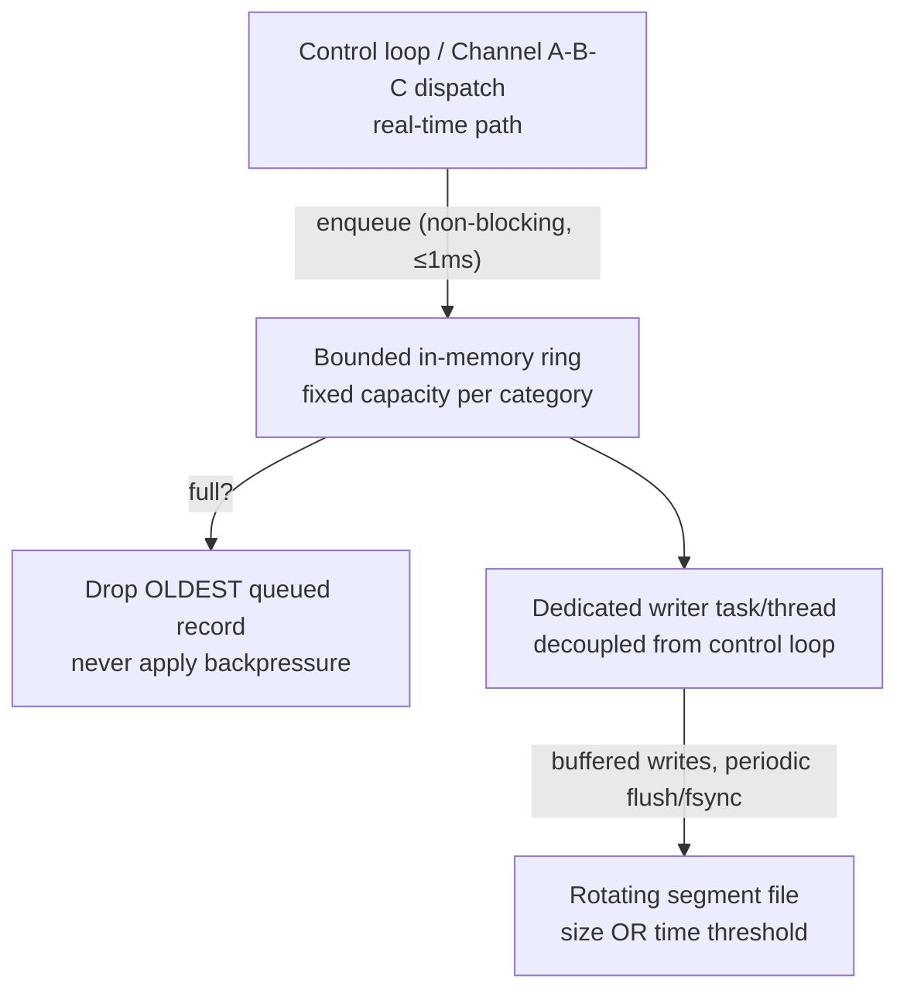

# Recording & Replay

Source of truth: `REQUIREMENTS.md` FR-9/NFR-6, `DESIGN.md` §10. Implemented in
[`roboprotocol-recording`](05-reference-implementation.md#roboprotocol-recording-library),
with playback/conversion tooling in `tools/replay-decode` and `tools/replay/`.

A real captured session — raw `.rec` segments plus their converted MP4/CSV output —
lives in [`docs/examples/recordings/`](examples/recordings/README.md).

## Design goal

Both endpoints can independently record their own Channel A/B/C traffic to local
rotating files — but recording must **never become a new failure mode for the control
loop it's observing.** Everything below follows from that one constraint.

## Zero re-encode: record the bytes that already exist

Recording doesn't run a second capture or encode pipeline — it appends the same bytes
already produced for transmission:

- **Channel A:** the reassembled Annex-B NAL units, the same bitstream handed to the
  local decoder for display.
- **Channel B / C:** the already-serialized FlatBuffers payload — the exact bytes
  about to go on the wire (or just decoded off it), never re-serialized, and never as
  JSON.

This keeps the marginal CPU cost of recording close to "one buffered `write()` call."

## Record framing

Each record in a segment file is a small fixed binary header directly prefixing the
already-produced payload bytes — not a FlatBuffers-wrapped table, since a segment file
is read by exactly one thing in this codebase (a replay/analysis tool), and a vtable
per record would be pure overhead with no schema-evolution benefit to justify it:

```text
record_len:      uint32   -- length of payload, for self-delimiting framing
capture_us:      uint64   -- recording endpoint's own local wall-clock capture time
control_source:  uint8    -- arbitrated ControlSource; 0xFF sentinel for Channel A/C records
payload:         [u8]     -- the unmodified wire-format bytes
```

`record_len` makes each record independently readable: a reader can always skip to
the next record boundary, so a truncated final record (e.g. from power loss mid-write)
never prevents reading everything recorded before it in the same segment.

## Writer pipeline: bounded queue, drop-oldest, never block



The enqueue step is the only part of this pipeline the control loop ever touches, and
it's a bounded-time push onto a fixed-capacity ring — never a disk write, never a lock
a slow writer could hold. If the writer falls behind, the ring fills and the *oldest*
not-yet-written record is dropped to make room for the newest — the same "latest wins"
philosophy Channel B itself applies at the protocol level.

## Rotation & retention

Each recorded category (video, command, telemetry, haptic, `ActionTrigger`, key-press)
rotates into a new segment at a configured **size** or **time** threshold, whichever
comes first, and enforces a configured total on-disk budget per category — writing a
new segment that would exceed it deletes the oldest existing segment(s) first.

Under shared storage pressure — the normal case at the robot edge — video's budget
shrinks or rotates faster before Channel B/C's does: a full session of joint/IMU/
battery/haptic telemetry is a few MB, a comparable video window is hundreds of MB to
GB, and the small channel is disproportionately more valuable for reconstructing an
incident afterward.

## Cross-endpoint time correlation

`capture_us` is always the *recording* endpoint's own local wall-clock time, never a
copy of a remote sender's embedded timestamp — recorded records from robot-edge and
operator-console are correlated after the fact by joining on Channel B's own `seq`
field (recoverable by decoding the payload), not by comparing raw wall clocks across
hosts. `roboprotocol_core::timestamp::estimate_clock_offset_us` computes the median
`local − remote` offset across matched `seq` pairs, robust to one-way jitter outliers
— self-contained, no external time service or internet dependency required. Verified
against a real joint session: 156/156 commands matched by `seq`, offset estimate
sub-millisecond and stable. See `PERFORMANCE.md` §6.5 for why WAN NTP was
deliberately not relied on for this (~1–50 ms accuracy, nowhere near tight enough for
a 50 Hz–1 kHz control loop).

## Turning recording on

**robot-edge** — config-only, set at launch, no runtime toggle:

```bash
./target/debug/robot-edge --robot-id xgo_real --camera \
  --record-dir /home/pi/recordings --record video,command,telemetry
```

**operator-console** — `--record-dir` makes recording *available*; the `r` key then
starts/stops the default set (video, your own commands, telemetry, key presses) at
runtime, so a normal session isn't recorded unless you press it:

```bash
./target/debug/operator-console --connect <pi-ip>:4433 --server-name robot-edge --video \
  --record-dir ./recordings
```

`--record-extra haptic,action` adds those two categories from launch instead — they
have no natural on/off point during a session, so they're not part of the `r` toggle.

| Flag | Controls |
|---|---|
| `--record-max-segment-mb` | Rotate to a new file at this size |
| `--record-max-segment-secs` | ...or this age, whichever first |
| `--record-budget-mb` | Total on-disk cap per category (video excluded) |
| `--record-video-budget-mb` | Same, for video specifically |
| `--record-flush-secs` | How often buffered writes flush to disk |

On disk, each category gets its own subdirectory under `--record-dir`, named after
the segment's start time:

```text
recordings/video-a/00001787217814008577.rec
recordings/channel-b-command/00001787217813005434.rec
recordings/key-press/00001787217864890016.rec
```

## Converting recordings for review

`.rec` segments aren't directly readable. Build `replay-decode` once, then:

```bash
cargo build --release -p replay-decode
tools/replay/convert_recordings.sh recordings   # writes to recordings/converted/
```

| Category directory | Becomes |
|---|---|
| `video-a` | `video-a.mp4` — re-encoded with a crosshair, live fps/kbps, each frame's `capture_us` burned in; arm x/z/claw state overlaid too if `channel-b-command` is present |
| `channel-b-command` | `channel-b-command.csv` — `capture_us,arm_x,arm_z,claw` |
| `channel-b-telemetry` | `channel-b-telemetry.csv` — `capture_us,seq,tick_id,region_id,battery,roll,pitch,yaw,motors` |
| `key-press` | `key-press.csv` — `capture_us,input` |
| `action-trigger-c` | `action-trigger-c.csv` — `capture_us,kind,...` (shared between `ActionTrigger` and `CameraControl` sends; disambiguated structurally via FlatBuffers vtable size, not value heuristics) |
| `channel-b-haptic` | `channel-b-haptic.csv` — raw hex; nothing in this codebase sends haptic frames yet |

A category directory that doesn't exist, or exists but is empty, is silently skipped.
Each conversion is also available standalone:

```bash
target/release/replay-decode <segment-dir> --category telemetry
tools/replay/recording_to_mp4.py --help
```

`recording_to_mp4.py` strips each record's framing, concatenates the H.264 payloads
in segment-filename order into a valid Annex-B stream, and remuxes via `ffmpeg`. With
no overlay flags this is a lossless `-c:v copy` remux; any overlay flag forces a
libx264 re-encode, since burning in graphics requires decoding each frame first.

## Cleaning up

Recordings (and old log files) accumulate fast, and the Pi's SD card is small:

```bash
xgo_bridge/scripts/clean.sh pi@<ip> [recordings-dir]
```
