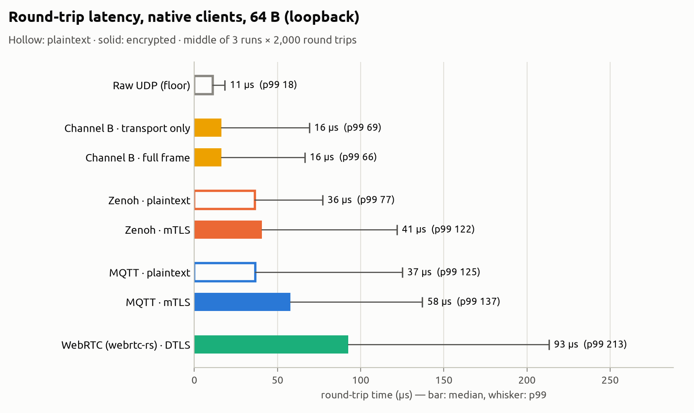
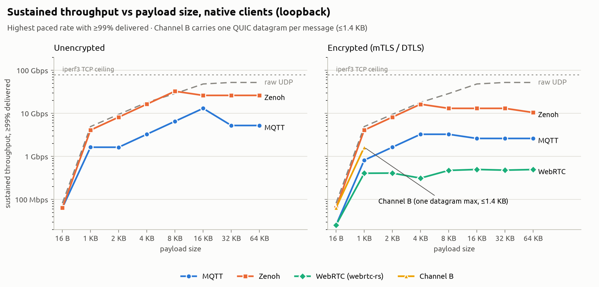
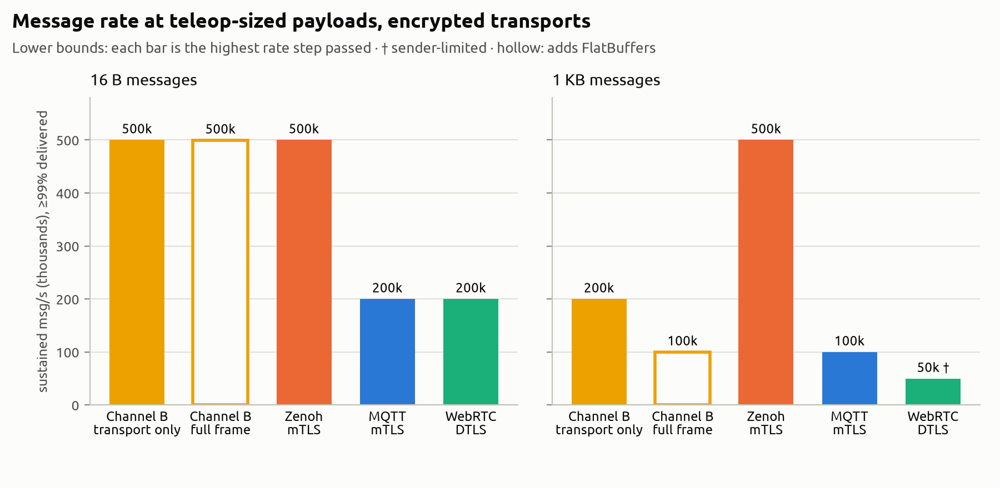
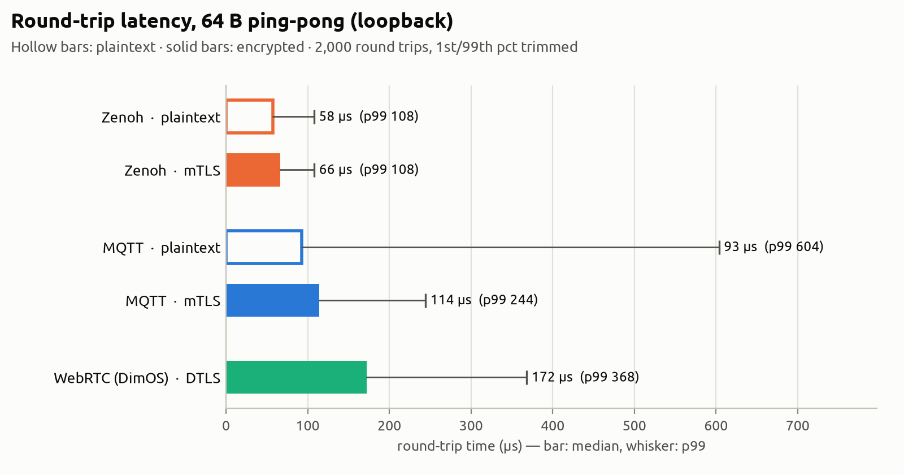
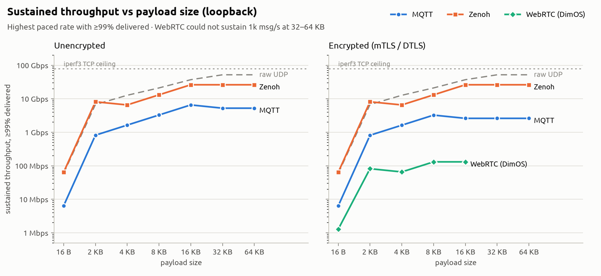
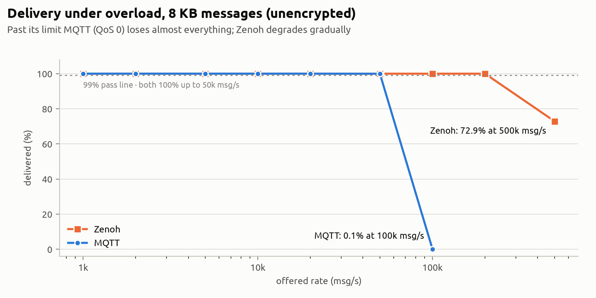

# Protocol comparison: RoboProtocol Channel B vs MQTT, Zenoh and WebRTC (loopback)

For the same comparison on real hardware over Wi-Fi, see [14 — Protocol comparison over Wi-Fi](14-protocol-comparison-wifi.md).

This report compares RoboProtocol's teleop channel (Channel B: QUIC
datagrams with mutual TLS) against three transports often used for robot
teleoperation and telemetry (MQTT, Zenoh and WebRTC), with raw UDP as the
protocol-free floor. It is Part 4 of the RoboProtocol benchmark runbook
([`BENCHMARK.md`](../BENCHMARK.md)).

The method follows Zenoh's 2023 comparison
([Zenoh vs MQTT vs Kafka vs DDS](https://zenoh.io/blog/2023-03-21-zenoh-vs-mqtt-kafka-dds/))
and adds three things:

- an encrypted (mutual TLS) variant of every protocol, because Channel B's
  encryption can't be turned off;
- compiled clients for every protocol, so Channel B, which is compiled Rust,
  is compared like for like;
- WebRTC as used by DimOS's hosted teleop (dimTELE).

## Key findings

<picture>
  <source media="(prefers-color-scheme: dark)" srcset="img/protocol-comparison/native-latency-dark.png">
  
</picture>

- **Channel B had the lowest latency of every protocol tested, and it was
  close to raw UDP.** With QUIC and mutual TLS always on, its median round
  trip was 16.3 µs. Raw UDP, with no protocol and no encryption, measured
  11.0 µs. Encrypted Zenoh measured 40.7 µs (2.5× Channel B), encrypted MQTT
  57.8 µs (3.5×) and native WebRTC 92.6 µs (5.7×). Channel B also beat both
  Zenoh and MQTT *without* encryption (36–37 µs).
- **Serialization doesn't change the latency result.** Channel B with its
  full FlatBuffers frame measured 16.4 µs, against 16.3 µs carrying the same
  opaque bytes as the other protocols. The difference is well inside the
  variation between runs.
- **For teleop-sized messages, Channel B matched the best message rate at
  16 bytes, but not at 1 KB.** At 16 B (a real teleop command is 20 B),
  Channel B and encrypted Zenoh both sustained 500k msg/s, against 200k for
  encrypted MQTT and WebRTC. At 1 KB, encrypted Zenoh sustained 500k msg/s
  and Channel B 200k. The likely cause is that Channel B sends one UDP
  packet per message, while Zenoh batches several messages into one write.
  Batched sending is planned (see [Next steps](#next-steps)).
- **Channel B carries messages of at most one QUIC datagram (about
  1.4 KB).** That is by design: teleop commands are small, and a command
  split across several packets could arrive partially. So Channel B has no
  rows above 1 KB. For bulk data, Zenoh peaked at 32.7 Gbps in plaintext
  and 16.4 Gbps with mTLS, levelling off at 26 and 13 Gbps for 16–64 KB
  messages.
- **The client implementation matters as much as the protocol.** With Python
  clients, MQTT topped out at 50k msg/s; with a compiled client it reached
  500k. Comparing a compiled protocol against Python clients would have
  overstated Channel B's lead several times over, which is why the headline
  results use compiled clients throughout.

## What was measured

| Protocol | Variant | Encryption | Topology |
|---|---|---|---|
| **RoboProtocol Channel B** | QUIC datagrams; transport only, and full FlatBuffers frame | TLS 1.3 + mTLS (always on) | direct, `robot-edge` ↔ `operator-console` |
| MQTT 3.1.1 | QoS 0 | none, or TLS 1.3 + mTLS | client → mosquitto broker → client |
| Zenoh 1.10.1 | peer to peer | none, or TLS + mTLS | direct peer link |
| WebRTC | DataChannels | DTLS (always on) | direct peer connection |
| Raw UDP | none | none | direct datagrams; the no-protocol floor |

There are two sets of results:

- **Native clients (the headline):** compiled Rust for every protocol, from
  [`tools/proto-bench`](../tools/proto-bench), plus the real `robot-edge` and
  `operator-console` release binaries for Channel B.
- **Python clients:** the earlier same-harness comparison with
  `benchmark/*_bench.py`. It is fair *between* MQTT, Zenoh and WebRTC, but it
  must not be set against Channel B, whose implementation is compiled. It is
  kept [at the end](#python-clients-same-harness-comparison) because it shows
  how much the client implementation matters.

### Channel B in bench mode

Channel B streams in one direction (commands in, telemetry out), so the
benchmark adds a bench mode to both binaries. Each session goes through the
normal handshake first (QUIC with mutual TLS, then HELLO and
SESSION_DESCRIBE); only then does the benchmark take over the same
connection.

- **`robot-edge --bench echo`** answers each message immediately, and
  **`--bench count`** counts them and logs totals once a second. Both refuse
  to start without `--stub-bridge`, because bench mode skips driving the
  robot.
- **Transport only (`--bench-raw`):** the same opaque bytes as the other
  protocols (a 16-byte sequence number and timestamp, plus padding) in a
  QUIC datagram behind Channel B's one-byte datagram tag. `robot-edge` echoes
  or counts the datagram without copying or parsing it. This is the like-for-
  like comparison, since MQTT, Zenoh and WebRTC also carry opaque bytes.
- **Full frame:** a real FlatBuffers `ChannelBFrame` command, which
  `robot-edge` decodes as far as unpacking the teleop command, and answers
  with a telemetry frame. This adds Channel B's serialization, as the
  protocol actually runs. The smallest full frame carries the real 20-byte
  command, so its 16 B row is 20 B.

### WebRTC

Two WebRTC implementations were measured:

- **`webrtc-rs`** (native, the headline row): the best case for WebRTC
  DataChannels with a compiled client.
- **DimOS's own stack** (Python clients section): DimOS's `WebRTCPubSub` at
  commit `edd7c34` over `aiortc`. That is what dimTELE runs on the robot.

dimTELE itself always routes through Cloudflare's Realtime SFU (a WebRTC
relay). In production the robot dials Dimensional's teleop broker, and
DimOS's own benchmark mode loops through a Cloudflare edge server. Neither
can run on loopback, so both WebRTC rows use a direct peer connection with a
local SDP exchange instead. For DimOS's stack this is a small peer-to-peer
provider ([`benchmark/webrtc_bench.py`](../benchmark/webrtc_bench.py)) that
implements DimOS's `Provider` interface. These rows are therefore
**dimTELE's WebRTC stack without Cloudflare**; a real session adds an
internet round trip to the nearest Cloudflare edge, and Cloudflare drops
DataChannel messages above about 64 KB.

Channel settings match dimTELE's in both: latency uses an unordered channel
with `maxRetransmits=0` (like its `cmd_unreliable` command channel), and
throughput a reliable, ordered channel (like `state_reliable`).

## Setup

| | |
|---|---|
| Machine | Intel Core i5-1240P laptop (12 cores / 16 threads, up to 4.4 GHz), 16 GB RAM |
| OS | Ubuntu 20.04.6 LTS, kernel 5.15.0-139-generic, CPU governor `powersave` (not pinned) |
| Topology | Single host, loopback (`127.0.0.1`), one process per endpoint |
| Channel B | `robot-edge` / `operator-console` release builds, `quiche` 0.22 (BoringSSL), thin LTO |
| Native clients | `tools/proto-bench`, rustc 1.97.1: `zenoh` 1.10.1, `rumqttc` 0.24.0 (rustls 0.22), `webrtc` 0.12.0 |
| Python clients | Python 3.11: `paho-mqtt` 2.1.0, `eclipse-zenoh` 1.10.1, `aiortc` 1.15.0 with DimOS `edd7c34` |
| Broker | mosquitto 2.1.2 in Docker (`--network host`) |
| Reference ceiling | `iperf3` TCP over loopback: **78.5 Gbps** |
| Code | RoboProtocol commit `8c3af3a` for the native run (`1dd2541` for the WebRTC 64 KB cell); `0fb2612` for the Python runs |

**How TLS was set up:**

- **Certificates:** every protocol uses the same dev CA and ECDSA P-256
  certificates as Channel B ([`certs/`](../certs)). The robot certificate is
  on the listening side and the operator certificate on the connecting side.
- **mosquitto:** a TLS-only listener that accepts TLS 1.3 only and requires a
  client certificate. Sessions negotiated `TLS_AES_256_GCM_SHA384`.
- **Zenoh:** `enable_mtls` and `verify_name_on_connect` on, with multicast
  scouting off, using the same config files from both the Python and the
  Rust client ([`benchmark/tls/`](../benchmark/tls)).
- **mTLS is enforced, not just offered.** For MQTT and Zenoh, a client
  without a certificate got no service. For Zenoh, a plain-TCP client also
  got no service.

## Method

### Latency

- **Test:** ping-pong round trips with a fixed 64-byte payload (ICMP-sized,
  as in the Zenoh post), 2,000 round trips per run.
- **Repeats:** three runs per protocol for the native clients. Tables show
  the run with the middle median, and list all three medians.
- **Reporting:** the fastest and slowest 1% are trimmed, then the median,
  p95 and p99 round-trip times (RTT) are reported. One-way latency is taken
  as half the median RTT. The Rust and Python clients use identical
  statistics code (unit-tested against each other).
- **Delivery mode:** best effort wherever the protocol offers it (MQTT QoS 0,
  unreliable WebRTC channel, QUIC datagrams), so retransmission doesn't show
  up in the latency.

### Throughput

- **Test:** one-way, at payload sizes of 16 B, 1, 2, 4, 8, 16, 32 and 64 KB.
  Channel B only runs 16 B and 1 KB, since each message is one datagram.
- **Search:** the sender is paced at a fixed rate that steps up through 1k,
  2k, 5k, 10k, 20k, 50k, 100k, 200k and 500k msg/s, then unpaced ("flood").
- **What each cell reports:** the highest rate step at which the receiver got
  at least 99% of what was sent. Each cell is therefore a lower bound; the
  real maximum lies between it and the next step (up to 2.5× apart).
- **Timing:** each trial sends for 10 s. The receiver counts over an 8 s
  window inside the send period, so start-up and shutdown are excluded.
- **Retries:** a trial that falls below 99% is re-run once before the search
  stops, because a single miss is often just connection timing.

We use a rate search, not "flood and count", because flooding measures
queue overflow, not the protocol. With an unpaced QoS 0 publisher, mosquitto
drops messages for any subscriber whose queue is full; a flood test reported
MQTT at 324 msg/s, which is meaningless.

### How this differs from the Zenoh post

- **Payload cap of 64 KB, not 512 MB.** This benchmark is about teleop and
  telemetry links. Raw UDP can't send a datagram over 65,507 B, and
  `webrtc-rs` can't send a DataChannel message over 65,535 B; those are the
  sizes used in their 64 KB rows.
- **Smallest payload is 16 B, not 8 B.** Every message carries a 16-byte
  sequence number and timestamp header.
- The Zenoh post, on a fixed-clock Ryzen 7 5800X, reported 67 Gbps for Zenoh
  peer to peer and about 9 Gbps for MQTT on one machine. Our native clients
  reached 32.7 Gbps and 13.1 Gbps on a laptop.

## Results: native clients

### Latency (64 B ping-pong)

The chart is at the top of this report.

| Protocol | Encryption | Median RTT | One-way | p95 | p99 | Medians of the 3 runs |
|---|---|---|---|---|---|---|
| Raw UDP (floor) | none | 11.0 µs | 5.5 µs | 18.1 µs | 18.4 µs | 11.0 / 11.2 / 6.4 |
| **Channel B, transport only** | TLS 1.3 + mTLS | **16.3 µs** | 8.2 µs | 59.3 µs | 69.1 µs | 22.4 / 13.8 / 16.3 |
| **Channel B, full frame** | TLS 1.3 + mTLS | **16.4 µs** | 8.2 µs | 57.7 µs | 66.4 µs | 16.4 / 16.2 / 17.0 |
| Zenoh (P2P) | none | 36.4 µs | 18.2 µs | 59.7 µs | 77.1 µs | 36.4 / 31.2 / 47.5 |
| MQTT (mosquitto) | none | 36.6 µs | 18.3 µs | 90.9 µs | 125.1 µs | 47.8 / 36.6 / 36.2 |
| Zenoh (P2P) | mTLS | 40.7 µs | 20.4 µs | 90.5 µs | 121.8 µs | 40.7 / 41.7 / 37.6 |
| MQTT (mosquitto) | TLS 1.3 + mTLS | 57.8 µs | 28.9 µs | 113.4 µs | 137.1 µs | 63.2 / 44.2 / 57.8 |
| WebRTC (`webrtc-rs`) | DTLS | 92.6 µs | 46.3 µs | 183.4 µs | 213.3 µs | 92.6 / 86.9 / 96.8 |

Channel B's p95 (about 58 µs) is wider than its median suggests: most round
trips are close to the UDP floor, but a few percent take several times
longer. Its p99 (66–69 µs) is still the lowest of any encrypted protocol.

For reference, `ping` over loopback had a minimum RTT of 22 µs. Its average
(67 µs) is inflated because `ping` sends one packet per second and the CPU
drops into idle states in between; use the native UDP ping-pong above as the
floor instead.

### Throughput

<picture>
  <source media="(prefers-color-scheme: dark)" srcset="img/protocol-comparison/native-throughput-dark.png">
  
</picture>

The dashed grey line in both panels is plaintext raw UDP, shown as a
reference; the dotted line is loopback TCP measured with `iperf3`.

For teleop the small-message rate matters more than bulk bandwidth:

<picture>
  <source media="(prefers-color-scheme: dark)" srcset="img/protocol-comparison/native-msgrate-dark.png">
  
</picture>

**Encrypted** (highest rate with ≥99% delivered):

| Payload | Channel B, transport only | Channel B, full frame | Zenoh + mTLS | MQTT + mTLS | WebRTC (`webrtc-rs`) |
|---|---|---|---|---|---|
| 16 B | 500k msg/s, 64 Mbps | 500k msg/s, 80 Mbps ‡ | 500k msg/s, 64 Mbps | 200k msg/s, 26 Mbps | 200k msg/s, 26 Mbps |
| 1 KB | 200k msg/s, 1.6 Gbps | 100k msg/s, 819 Mbps | 500k msg/s, 4.1 Gbps | 100k msg/s, 819 Mbps | 50k msg/s, 408 Mbps † |
| 2 KB | n/a | n/a | 500k msg/s, 8.2 Gbps | 100k msg/s, 1.6 Gbps | 25k msg/s, 411 Mbps † |
| 4 KB | n/a | n/a | 499k msg/s, 16.4 Gbps | 100k msg/s, 3.3 Gbps | 10k msg/s, 313 Mbps † |
| 8 KB | n/a | n/a | 200k msg/s, 13.1 Gbps | 50k msg/s, 3.3 Gbps | 7k msg/s, 475 Mbps † |
| 16 KB | n/a | n/a | 100k msg/s, 13.1 Gbps | 20k msg/s, 2.6 Gbps | 4k msg/s, 499 Mbps † |
| 32 KB | n/a | n/a | 50k msg/s, 13.1 Gbps | 10k msg/s, 2.6 Gbps | 2k msg/s, 481 Mbps † |
| 64 KB | n/a | n/a | 20k msg/s, 10.5 Gbps | 5k msg/s, 2.6 Gbps | 947 msg/s, 497 Mbps † |

**Unencrypted:**

| Payload | Raw UDP | Zenoh (P2P) | MQTT (QoS 0) |
|---|---|---|---|
| 16 B | 641k msg/s, 82 Mbps | 500k msg/s, 64 Mbps | 500k msg/s, 64 Mbps |
| 1 KB | 603k msg/s, 4.9 Gbps | 500k msg/s, 4.1 Gbps | 200k msg/s, 1.6 Gbps |
| 2 KB | 580k msg/s, 9.5 Gbps | 500k msg/s, 8.2 Gbps | 100k msg/s, 1.6 Gbps |
| 4 KB | 551k msg/s, 18.0 Gbps | 500k msg/s, 16.4 Gbps | 100k msg/s, 3.3 Gbps |
| 8 KB | 441k msg/s, 28.9 Gbps † | 500k msg/s, 32.7 Gbps | 100k msg/s, 6.6 Gbps |
| 16 KB | 369k msg/s, 48.3 Gbps † | 200k msg/s, 26.2 Gbps | 100k msg/s, 13.1 Gbps |
| 32 KB | 200k msg/s, 52.4 Gbps | 100k msg/s, 26.2 Gbps | 20k msg/s, 5.2 Gbps |
| 64 KB | 100k msg/s, 52.3 Gbps | 50k msg/s, 26.2 Gbps | 10k msg/s, 5.2 Gbps |

- † The sender couldn't reach the next rate step, but everything it sent
  arrived, so the cell shows the client's limit, not the protocol's. For
  `webrtc-rs` this is its blocking `send()` call, which caps it at roughly
  1k–50k msg/s depending on size.
- ‡ The full frame's smallest payload is the real 20-byte teleop command, so
  this cell carries 20 B per message.
- n/a: above one QUIC datagram, Channel B's maximum message size.

**Channel B's limits, in detail:**

- **1 KB, transport only:** passed 200k msg/s. At the 500k step it delivered
  144k–224k msg/s (two attempts), so its maximum is roughly 200k–250k msg/s,
  about 2 Gbps. Encrypted Zenoh passed 500k at the same size.
- **1 KB, full frame:** passed 100k msg/s and delivered about 168k msg/s at
  the 200k step. Building and decoding a FlatBuffers frame around every 1 KB
  message costs about half the rate here, unlike at 16 B where it costs
  nothing measurable.
- **Unpaced flood:** both Channel B variants delivered almost nothing
  (15–60 msg/s) when the sender ignored pacing entirely. The flood causes
  heavy packet loss at the saturated receiver, and quiche's congestion
  control, which also applies to datagrams, reacts by shrinking what it will
  send. Every other protocol degraded more gracefully at this step. This
  happens only beyond the 500k msg/s step Channel B already passed, but a
  sender that can overload its own link should pace itself.

## Results: Python clients (same-harness comparison)

These results come from the earlier runs with Python clients for every
protocol (Channel B wasn't run this way, because its implementation is
compiled). They are fair between MQTT, Zenoh and DimOS's WebRTC, and they
show how much a client's implementation shapes its numbers: native MQTT at
16 B reached 500k msg/s against 50k with `paho-mqtt`.

### Latency

<picture>
  <source media="(prefers-color-scheme: dark)" srcset="img/protocol-comparison/latency-dark.png">
  
</picture>

| Protocol | Encryption | Median RTT | One-way | p95 | p99 |
|---|---|---|---|---|---|
| Zenoh (P2P) | none | 57.6 µs | 28.8 µs | 78.5 µs | 107.8 µs |
| MQTT (mosquitto) | none | 93.0 µs | 46.5 µs | 213.8 µs | 603.8 µs |
| Zenoh (P2P) | mTLS | 66.2 µs | 33.1 µs | 85.3 µs | 108.0 µs |
| MQTT (mosquitto) | TLS 1.3 + mTLS | 114.0 µs | 57.0 µs | 173.5 µs | 244.3 µs |
| WebRTC (DimOS stack) | DTLS | 172.4 µs | 86.2 µs | 261.8 µs | 368.3 µs |

These runs used one run per protocol, a day apart. Across three earlier runs
Zenoh's plaintext median stayed between 52 and 58 µs, while MQTT's varied
from 87 to 142 µs, so treat MQTT's tail values here as rough.

### Throughput

<picture>
  <source media="(prefers-color-scheme: dark)" srcset="img/protocol-comparison/throughput-dark.png">
  
</picture>

| Payload | MQTT | Zenoh | Raw UDP | MQTT + mTLS | Zenoh + mTLS |
|---|---|---|---|---|---|
| 16 B | 50k msg/s, 6 Mbps | 500k msg/s, 64 Mbps | 462k msg/s, 59 Mbps † | 50k msg/s, 6 Mbps | 500k msg/s, 64 Mbps |
| 2 KB | 50k msg/s, 818 Mbps | 496k msg/s, 8.1 Gbps | 411k msg/s, 6.7 Gbps † | 50k msg/s, 815 Mbps | 497k msg/s, 8.1 Gbps |
| 4 KB | 50k msg/s, 1.6 Gbps | 200k msg/s, 6.6 Gbps | 389k msg/s, 12.7 Gbps † | 50k msg/s, 1.6 Gbps | 200k msg/s, 6.6 Gbps |
| 8 KB | 50k msg/s, 3.3 Gbps | 200k msg/s, 13.1 Gbps | 322k msg/s, 21.1 Gbps † | 50k msg/s, 3.3 Gbps | 200k msg/s, 13.1 Gbps |
| 16 KB | 50k msg/s, 6.6 Gbps | 200k msg/s, 26.2 Gbps | 283k msg/s, 37.1 Gbps † | 20k msg/s, 2.6 Gbps | 200k msg/s, 26.2 Gbps |
| 32 KB | 20k msg/s, 5.2 Gbps | 100k msg/s, 26.2 Gbps | 199k msg/s, 52.1 Gbps | 10k msg/s, 2.6 Gbps | 100k msg/s, 26.2 Gbps |
| 64 KB | 10k msg/s, 5.2 Gbps | 50k msg/s, 26.2 Gbps | 99k msg/s, 52.1 Gbps | 5k msg/s, 2.6 Gbps | 50k msg/s, 26.2 Gbps |

DimOS's WebRTC stack (`aiortc`, reliable ordered channel) capped out at
about 180–190 Mbps whatever the size: 10k msg/s at 16 B, 5k at 2 KB, 1k at
16 KB, and below 1k msg/s at 32–64 KB (peak goodput 184–188 Mbps at under
99% delivered). The limit is `aiortc`'s pure-Python SCTP and DTLS.

### MQTT under overload

What happens when MQTT (QoS 0) is pushed past its maximum rate:

<picture>
  <source media="(prefers-color-scheme: dark)" srcset="img/protocol-comparison/overload-dark.png">
  
</picture>

| Payload | Offered | Delivered |
|---|---|---|
| 2 KB | 100k msg/s | 26% |
| 4 KB | 100k msg/s | 8% |
| 8 KB | 100k msg/s | 0.1% |

Past its limit, a QoS 0 subscriber loses nearly everything rather than just
the excess.

## Discussion

**Latency.** On one machine, per-message CPU cost is almost all of the
latency, so these numbers rank software stacks rather than network paths:

- **Channel B** makes one hop over a single QUIC connection, and its
  datagrams are neither retransmitted nor ordered, so a message is handed
  over as soon as it is decrypted. That puts it within about 5 µs of raw
  UDP, with encryption included.
- **Zenoh and MQTT** were close in plaintext (36–37 µs). With mTLS, MQTT
  pays for TLS on both legs through the broker, and Zenoh on one.
- **WebRTC** puts every DataChannel message through SCTP framing and then
  DTLS. Even compiled, that costs about 80 µs more than Channel B.

On a real network the link's own delay is added to every row. That makes
the relative gaps smaller, but not the order.

**Encryption.** TLS adds a few microseconds per message on a CPU with
hardware AES support. The exception is large messages through a broker: MQTT
with mTLS stayed at 2.6–3.3 Gbps while plaintext MQTT reached 13.1 Gbps,
because the broker decrypts and re-encrypts every message. Always-on
encryption costs Channel B little, which is why the comparison comes down to
design rather than crypto.

**Message rate.** Channel B sends every message as its own UDP packet
through a single-threaded event loop. At 16 B that keeps up with the best
(500k msg/s); at 1 KB the per-packet cost shows, and Zenoh, which batches
messages into fewer, larger writes, sustains more than twice the rate. Batched
UDP sends (`sendmmsg`, or GSO, the kernel's segmentation offload) are the
usual fix, and the next step for Channel B. Real teleop traffic is 20-byte
commands at 50–1,000 Hz, far below any of these limits.

**Bulk data** isn't Channel B's job; RoboProtocol carries video on Channel A
and session data on Channel C. For bulk transfer, Zenoh tracked raw UDP up
to 32.7 Gbps.

**What this benchmark doesn't show** is how each protocol behaves when the
link is actually full, for example when video and control share a Wi-Fi
uplink. That is what a teleop protocol is for, and it is planned separately
in [12 — Control under load](12-control-under-load-benchmark.md).

## Limitations

- **Loopback only.** There is no real link, so no link delay, loss or
  reordering, and no bandwidth limit below the memory bus. A two-machine
  testbed is planned in doc 12.
- **CPU clock not fixed.** The governor was `powersave` on a laptop with a
  mix of performance and efficiency cores, and processes weren't pinned to
  cores. Medians are stable to within a few microseconds; tail percentiles
  vary between runs.
- **The laptop suspended twice during the native throughput run**
  (22:02–23:44 and 00:05–07:48). Both ends' timers are monotonic, so a trial
  caught by a suspend was paused rather than skewed. The 16 B cells matched
  an independent earlier run, and three spot-check reruns from the affected
  stretches reproduced their results.
- **Coarse rate steps.** Throughput cells are lower bounds, accurate to
  within one step (up to 2.5×).
- **Client differences:** `rumqttc` (native MQTT) has a bounded request
  queue, so a sender that outruns the socket waits instead of queueing
  without limit as `paho-mqtt` does; `webrtc-rs`'s blocking send limits its
  rate (marked †).
- **Channel B's cipher suite** wasn't recorded in this run.
- **WebRTC without Cloudflare.** The WebRTC rows exclude the Cloudflare relay
  that every real dimTELE session goes through.
- **DDS and Kafka not tested.** Kafka is built for durable logs, not control
  loops. DDS would matter for a ROS 2 comparison, which isn't the goal here.

## Reproducing

Everything runs from `benchmark/`. Commands assume a Python 3.11 venv at
`benchmark/.venv`.

```bash
# native clients and Channel B release binaries
cargo build --release -p proto-bench -p robot-edge -p operator-console

# Python client libraries (Python results and the driver)
uv venv -p 3.11 benchmark/.venv
uv pip install -p benchmark/.venv/bin/python paho-mqtt "eclipse-zenoh>=1,<2" \
    "aiortc>=1.14.0" "aiohttp>=3.9.0" pydantic "structlog>=25.5.0,<26" matplotlib
# DimOS WebRTC pubsub only (the heavy base deps aren't needed)
git clone https://github.com/dimensionalOS/dimos && git -C dimos checkout edd7c34
DIMOS_ALLOW_MISSING_COCKPIT=1 uv pip install -p benchmark/.venv/bin/python --no-deps ./dimos

# broker: plaintext on 1883, mTLS (TLS 1.3, client cert required) on 8883
docker run -d --rm --name bench-mosquitto --network host \
    -v $PWD/benchmark/tls/mosquitto.conf:/mosquitto/config/mosquitto.conf:ro \
    -v $PWD/certs:/certs:ro eclipse-mosquitto:2

cd benchmark
# native clients and Channel B (the headline results); keep the machine awake
systemd-inhibit --what=sleep:idle:handle-lid-switch .venv/bin/python run_loopback.py \
    rs-udp rs-zenoh rs-mqtt rs-zenoh-tls rs-mqtt-tls rs-webrtc channel-b-raw channel-b
# Python clients
.venv/bin/python run_loopback.py mqtt zenoh udp
.venv/bin/python run_loopback.py mqtt-tls zenoh-tls
.venv/bin/python run_loopback.py webrtc

.venv/bin/python summarize.py results/<run-dir> [results/<run-dir> ...]
# charts in docs/img/protocol-comparison/ (light + dark)
.venv/bin/python plot_results.py --plain results/<run> --tls results/<run> \
    --webrtc results/<run> --native results/<run>
```

Each run directory has `results.json` (every trial, not just the best ones,
plus all three latency runs) and `run.log`. Every client can also be run by
hand: `tools/proto-bench <udp|zenoh|mqtt|webrtc> <responder|pingpong|send|recv>`,
`robot-edge --bench echo|count --stub-bridge`, `operator-console --bench
pingpong|send --headless [--bench-raw]`, and the `benchmark/*_bench.py`
scripts.

## Next steps

1. **Batched sends for Channel B** (`sendmmsg` / GSO) in `robot-edge` and
   `operator-console`, then rerun the 1 KB rows. Both the shipped and the
   batched numbers will be published.
2. **Control under load** on two Raspberry Pis with shaped links:
   [doc 12](12-control-under-load-benchmark.md).
3. **Fixed CPU clock:** `performance` governor and pinned cores, so tail
   latencies repeat between runs.
4. **Large payloads:** an appendix at 256 KB to 16 MB (camera frames and
   point clouds) for MQTT and Zenoh.
